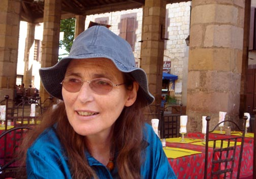

Bev Sedley retired in November 2002 as co-ordinator of [Lifecraft](http://www.lifecraft.org.uk/), a Cambridge mental health voluntary organisation which she founded and ran for its first ten years, subsequently returning as chair of the Board of Trustees. 
She now works largely as a Trustee of [Cambridge Carbon Footprint](http://www.cambridgecarbonfootprint.org/) and Chair of [Cambridge Sustainable Food](http://www.cambridgesustainablefood.org/).

She has some [dietary requirements](Bevs_Diet).
